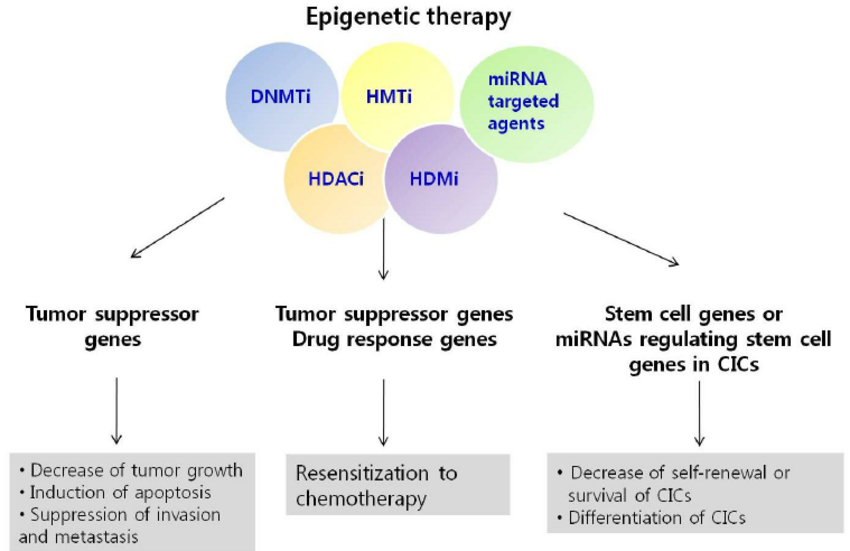

```{r setup, include=FALSE}
knitr::opts_chunk$set(echo = FALSE)
```



**I. Source of the article**

URL : [link](https://www.news-medical.net/news/20201111/Researchers-uncover-potential-genetic-target-for-treating-endometriosis.aspx)

Date : November 11, 2020

Word count : 456

**II. Vocabulary**

| *Word from the text* | *Synonym/definition in English* | *French translation*             |
|----------------------|---------------------------------|----------------------------------|
| To undergo surgery   | An operation on something       | Se faire opérer de quelque chose |
| Prior to             | Before something                | Avant                            |
| Further              | More extended                   | Plus approfondi                  |
| To rule out          | To eliminate, to exclude        | Ecarter, exclure                 |
| The inquiry          | Formal investigation            | Enquête                          |


**III. Analysis tale about the study**

| Researchers ?                | Michigan State University researchers                                                                                                                                                                         |
|------------------------------|---------------------------------------------------------------------------------------------------------------------------------------------------------------------------------------------------------------|
| Published in ? When ?        | In Cell Reports                                                                                                                                                                                               |
| General topic                | Type of endometriosis caused by a mutation in a gene called ARID1A                                                                                                                                            |
| Procedure/What was examined  | - Mutation of gene ARID1A -Drug effect on spread of endometriosis                                                                                                                                             |
| Conclusions/ discovery       | -Endometriosis caused by mutation in a gene is the most severe form -Treatment by drug could be more effective  -Drug target a protein in cells called P300 -Search to found other drugs with same fonctions  |
| Remaining questions          | /                                                                                                                                                                                                             |
