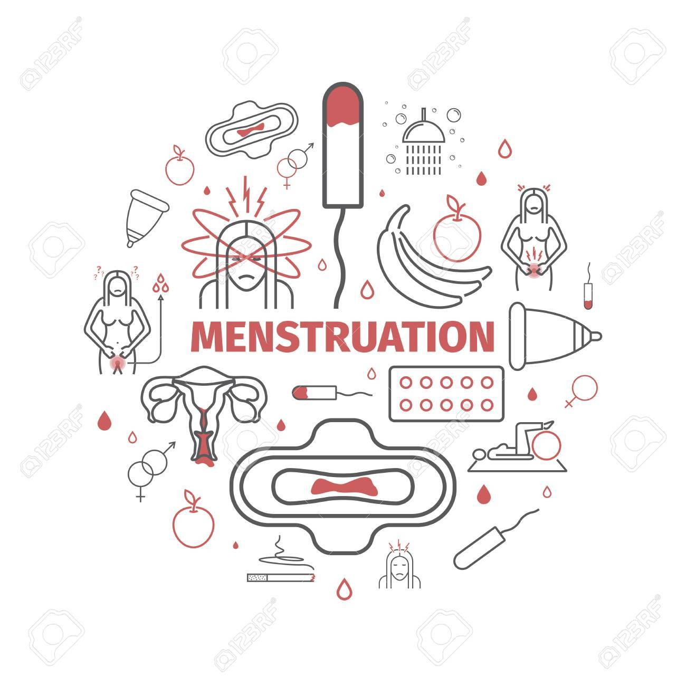

```{r setup, include=FALSE}
knitr::opts_chunk$set(echo = FALSE)
```



**I. Source of the article**

URL : [link](https://www.bbc.com/news/uk-wales-55904381)

Date : March 2, 2020

Word count : 900

**II. Vocabulary**

| **Word from the text** | **Synonym/definition in English** | **French translation** |
|------------------------|-----------------------------------|------------------------|
| Certainty              | The state of being certain        | Certitude              |
| Faint                  | A temperary loss of consciousness | Evanouissmeent         |
| Bittersweet            | Both pleasant and painful         | Doux-amer              |
| Misconception          | A mistaken or erroneaous idea     | Fausse idée            |

**III. Analysis tale about the study**

| Autor(s) ?                   | Alex Jennings                                                                                                                                                                                                                                                                                                                                                                                                                                                         |
|------------------------------|-----------------------------------------------------------------------------------------------------------------------------------------------------------------------------------------------------------------------------------------------------------------------------------------------------------------------------------------------------------------------------------------------------------------------------------------------------------------------|
| Published in ? When ?        | BBC News                                                                                                                                                                                                                                                                                                                                                                                                                                                              |
| General topic                | A new curriculum tp consider menstrual wellbeing                                                                                                                                                                                                                                                                                                                                                                                                                      |
| Procedure/What was examined  | A woman who has wainting 11 years to have a diagnosis. Symptoms appear at the age of 10. She had two laparoscopies.  If she had been told about menstrual pain at school it would have helped.  Senedd Suzy Davies want to talk about endometriosis in school : idea rejected by the Children, Young People & Education Committee.  Time for diagnosis is more longer in Wales than in UK.  Education Minister, Kristy Williams, approve the importance of the topic. |
| Conclusions/ discovery       | No cure, only tretment to reduce painful  Delays more longer because of coronavirus disease  Suffering everyday, not just on period  Wantto overcome taboos and misconceptions                                                                                                                                                                                                                                                                                        |
| Remaining questions          | /                                                                                                                                                                                                                                                                                                                                                                                                                                                                     |
