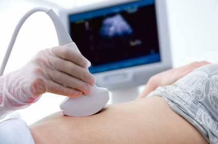

```{r setup, include=FALSE}
knitr::opts_chunk$set(echo = FALSE)
```



**I. Source of the article**

URL : [link](https://www.bbc.com/news/uk-scotland-56287913)

Date : March 6, 2021

Word count : 910

**II. Vocabulary**

| **Word from the text** | **Synonym/definition in English**                                     | French translation                      |
|------------------------|-----------------------------------------------------------------------|-----------------------------------------|
| A lack                 | Absence of something needed or desirable                              | Une absence, un manque de quelque chose |
| Awareness              | Mindfulness                                                           | Sensibilisation, prise de conscience    |
| A flare-up             | A sudden burst of something                                           | Une poussée, une flambée                |
| Awful                  | Unpleasant, causing shock or fear                                     | Horrible, épouvantable                  |
| To ensure              | To guarantee, to make sure                                            | Assurer, guarantir                      |
| A broadcaster          | A person or organization that broadcasts radio or television programs | Un animateur télé/radio                 |
| An attempt             | An effort mode to accomplish something                                | Une tentative, un essai                 |
| To ease                | To become less painful                                                | Soulager, atténuer                      |
| To cripple             | To keep from working well                                             | Handicaper                              |

**III. Analysis table about the study**

| Autor ?                     | /                                                                                                                                                                                                                                                                  |
|-----------------------------|--------------------------------------------------------------------------------------------------------------------------------------------------------------------------------------------------------------------------------------------------------------------|
| Published in ? When ?       | BBC News                                                                                                                                                                                                                                                           |
| General topic               | GPs say to get pregnant to reduce pain.                                                                                                                                                                                                                            |
| Procedure/what was examined | Experts want more research and mindfulness about endometriosis. Sophie Buchan's GP said her to get pregnant to reduce pain. Prof Andrew Horne disagree with him. Nobody can tell a woman to get pregnant. Ethnic minorities are even more affected by this problem |
| Conclusions                 | Diagnosis endometriosis is difficult because symptoms are similar to other ilnessess. Laser surgery can perforate bowel.                                                                                                                                           |
| Remaining questions         | /                                                                                                                                                                                                                                                                  |
